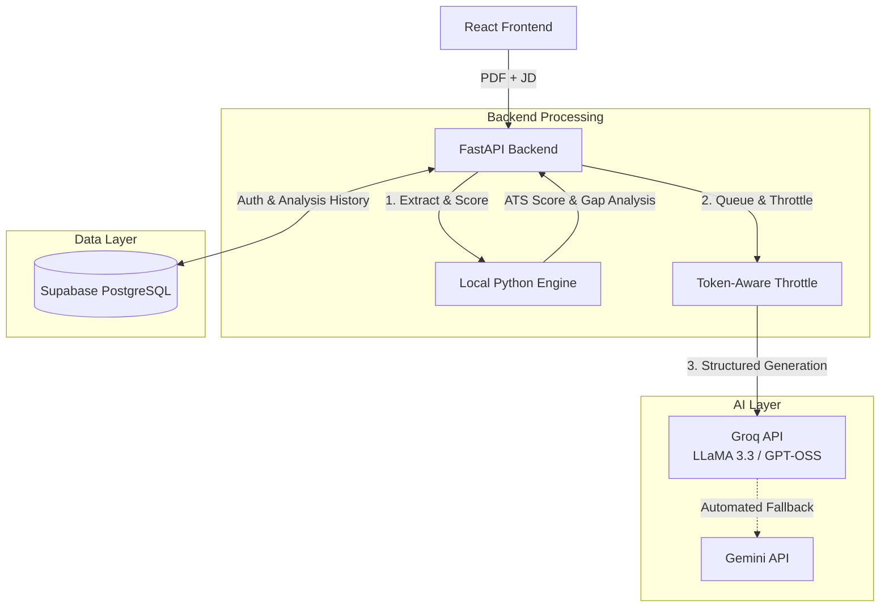

<div align="center">

# 📄 ResumeAI — Full-Stack ATS Resume Analyzer & Career Suite

**A high-performance resume optimizer, bullet-point rewriter, and interview simulator built on a hybrid 60/40 Local & LLM architecture.**

[](https://ai-resume-analyzer-two-red.vercel.app)


</div>

---

## 🎯 What This Project Does

ResumeAI solves the primary bottleneck candidates face with modern **Applicant Tracking Systems (ATS)**: resumes getting filtered out due to missing keywords, weak bullet phrasing, or poor job alignment.

The app takes a candidate's **PDF resume** and a target **Job Description (JD)** and delivers:
1. **Instant ATS Score & Keyword Gap Analysis** (Matched vs. Missing Skills).
2. **Impact-Driven Bullet Rewrites** using Google's **XYZ Formula** (*"Accomplished X, measured by Y, doing Z"*).
3. **Tailored Cover Letter Generation** bridging experience gaps.
4. **Interactive Technical & Behavioral Mock Interview Prep**.

---

## 🏗️ Technical Highlights: Hybrid 60/40 Architecture

Most AI apps pass raw text back and forth to expensive LLM endpoints, causing high latency, rate-limit failures, and ballooning costs. **ResumeAI uses a hybrid engine designed for production efficiency**:

```
                               ┌──────────────────────────────────────────────┐
                               │             USER UPLOADS PDF + JD            │
                               └──────────────────────┬───────────────────────┘
                                                      │
                                                      ▼
                               ┌──────────────────────────────────────────────┐
                               │            FASTAPI BACKEND ENGINE            │
                               └──────────────┬────────────────┬──────────────┘
                                              │                │
                      60% LOCAL (0 TOKENS)    │                │  40% AI LAYER
                                              ▼                ▼
                               ┌─────────────────────┐  ┌─────────────────────┐
                               │  pdfplumber & Fuzzy │  │ Token-Aware Throttle│
                               │  Keyword Matching   │  │   (Rolling Window)  │
                               └──────────┬──────────┘  └──────────┬──────────┘
                                          │                        │
                                          ▼                        ▼
                               ┌─────────────────────┐  ┌─────────────────────┐
                               │ ATS Score & Missing │  │  Groq API / Gemini  │
                               │   Keyword List      │  │  Rewrites & Prep    │
                               └─────────────────────┘  └─────────────────────┘
```

- **60% Local Python Engine (Zero Token Overhead):** PDF text extraction (`pdfplumber`), string normalization, fuzzy keyword grouping, and ATS eligibility scoring run locally on Python. This runs in milliseconds at $0 API cost.
- **40% Targeted AI Generation (Groq + Gemini Fallback):** Groq's high-speed inference engine generates structured JSON for bullet rewrites, cover letters, and interview questions. Fallback routing automatically fails over to Gemini 2.5 Flash if needed.
- **Token-Aware Throttle Control:** A thread-safe sliding window rate-limiter prevents 429 errors under burst traffic by tracking consumed tokens per minute rather than simple request counts.

---

## 🧠 System Architecture



---

## ✨ Features at a Glance

| Feature | Description | Engine |
| :--- | :--- | :--- |
| **ATS Scoring & Gap Analysis** | Calculates ATS match %, extracts mandatory vs. optional missing keywords, flags resume format warnings. | Python Local Engine |
| **XYZ Bullet Point Rewriter** | Rewrites weak bullets into quantified metric-driven achievements using Google's XYZ recruiter standard. | Groq API (Structured JSON) |
| **Tailored Cover Letter** | Generates a 3-paragraph role-specific cover letter tying candidate skills directly to JD requirements. | Groq API |
| **Mock Interview Plan** | Generates multi-round technical, behavioral, and role-specific interview questions with ideal sample answers. | Groq API |
| **Auth & History Hub** | Secure user authentication and complete history tracking of all past scans and AI improvements. | Supabase PostgreSQL |

---

## 💻 Running Locally (Testing the Project)

Follow these steps to run the full stack locally:

### 1. Clone the repository
```bash
git clone https://github.com/gnanesh-reddy-12/Ai-Resume-Analyzer.git
cd Ai-Resume-Analyzer
```

### 2. Backend Setup (FastAPI)
In the `backend` directory:
```bash
cd backend
python -m venv venv
# Activate virtual environment:
# Windows: venv\Scripts\activate | Mac/Linux: source venv/bin/activate
pip install -r requirements.txt
```

Create a `.env` file in the `backend` directory:
```env
GROQ_API_KEY=your_groq_api_key
GEMINI_API_KEY=your_gemini_api_key
SUPABASE_URL=your_supabase_url
SUPABASE_KEY=your_supabase_anon_key
JWT_SECRET=your_jwt_secret
```

Run the backend API server:
```bash
uvicorn main:app --reload
```

### 3. Frontend Setup (React)
In the root directory (open a new terminal):
```bash
npm install
```

Create a `.env` file in the root directory:
```env
VITE_SUPABASE_URL=your_supabase_url
VITE_SUPABASE_ANON_KEY=your_supabase_anon_key
```

Start the Vite development server:
```bash
npm run dev
```

### 4. How to Test
1. Open `http://localhost:5173` in your browser and log in or create an account.
2. Upload any PDF resume and paste a target Job Description.
3. Click **Analyze** to test the zero-token local ATS engine.
4. Navigate through **Improve**, **Cover Letter**, and **Mock Interview** tabs to test AI generation and the custom token-aware throttle.

---

## 🛠️ Technology Stack

- **Frontend:** React 19, Vite, Tailwind CSS, Framer Motion
- **Backend:** Python 3.11, FastAPI, Pydantic, pdfplumber
- **AI Integration:** Groq API, Google Gemini API
- **Database & Auth:** Supabase (PostgreSQL)
- **Deployment:** Vercel (Frontend), Render (Backend)

---

## 📁 Project Structure

```text
ai-resume-analyzer/
├── backend/                  # FastAPI Python backend
│   ├── main.py               # API endpoints, local scoring engine, and LLM throttle logic
│   ├── requirements.txt      # Backend Python dependencies
│   ├── _scripts/             # Test scripts & schema verification tools
│   └── Procfile              # Production deployment config
├── src/                      # React frontend
│   ├── components/           # UI components (Navbar, Sidebar, Modals, Cards)
│   ├── context/              # Auth & state management context
│   ├── pages/                # App pages (Dashboard, Improve, CoverLetter, Interview, History)
│   ├── App.jsx               # Main layout and client-side routing
│   ├── index.css             # Design tokens and Tailwind styles
│   └── supabase.js           # Supabase client setup
├── public/                   # Static web assets
└── vite.config.js            # Vite build configuration
```

---

<div align="center">
Built by <a href="https://www.linkedin.com/in/gnanesh-reddy/">Gnanesh Reddy</a>
</div>