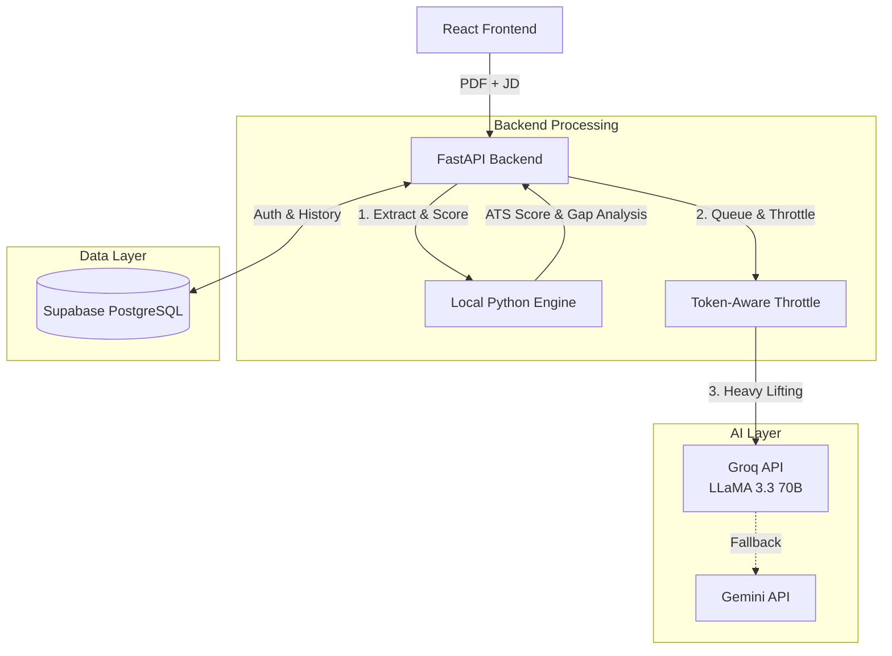

<div align="center">

# ResumeAI — Full-Stack ATS Resume Analyzer

**A tool to grade resumes, rewrite weak bullet points, and generate interview prep using a hybrid local/LLM architecture.**

[](https://ai-resume-analyzer-two-red.vercel.app)


</div>

---

## 🚀 Overview

ResumeAI is a full-stack web application that helps job seekers align their resumes with specific Job Descriptions (JDs). 

Instead of routing the entire process through an LLM, the application uses a **hybrid 60/40 architecture** to maximize speed and minimize API costs:
- **60% Local Python Processing:** PDF text extraction, fuzzy string matching, ATS scoring, and keyword gap analysis are all handled locally on the backend. This costs zero API tokens and runs instantly.
- **40% AI Generation:** The Groq API (with Gemini as a fallback) is invoked strictly for complex generation tasks, such as rewriting weak bullet points and creating interview plans.

The backend also features a **custom token-aware throttle** using Python threading locks to queue concurrent requests and prevent rate-limit crashes during heavy usage.

## 🧠 System Architecture



## ✨ Features

- **ATS Scoring & Gap Analysis:** Compares the resume against a target JD. Identifies missing keywords and calculates a compatibility score entirely in local Python.
- **AI Bullet Point Rewrite:** Rewrites weak or generic resume bullet points using the "XYZ Formula" (Action Verb + Specific Metric + Technology) to make them recruiter-friendly.
- **Cover Letter Generation:** Generates a targeted cover letter bridging the gap between the candidate's existing experience and the specific JD.
- **Mock Interview Simulator:** Analyzes the skill gaps and generates a multi-round technical and behavioral mock interview plan.
- **Authentication & History:** Built on Supabase to handle secure user sign-ups, logins, and persistent storage of past resume analyses.

## 💻 Running Locally (Testing the Project)

If you'd like to test this project on your own machine, follow these steps:

### 1. Clone the repository
```bash
git clone https://github.com/gnanesh-reddy-12/Ai-Resume-Analyzer.git
cd Ai-Resume-Analyzer
```

### 2. Backend Setup (FastAPI)
Open a new terminal in the `backend` folder:
```bash
cd backend
python -m venv venv
# Windows: venv\Scripts\activate | Mac/Linux: source venv/bin/activate
pip install -r requirements.txt
```
Create a `.env` file in the `backend` folder and add your API keys:
```env
GROQ_API_KEY=your_groq_api_key
GEMINI_API_KEY=your_gemini_api_key
SUPABASE_URL=your_supabase_url
SUPABASE_KEY=your_supabase_anon_key
JWT_SECRET=your_jwt_secret
```
Run the backend server:
```bash
uvicorn main:app --reload
```

### 3. Frontend Setup (React)
Open a separate terminal in the root folder:
```bash
npm install
```
Create a `.env` file in the root folder for Supabase:
```env
VITE_SUPABASE_URL=your_supabase_url
VITE_SUPABASE_ANON_KEY=your_supabase_anon_key
```
Run the frontend development server:
```bash
npm run dev
```

### 4. How to Test
1. Open `http://localhost:5173` in your browser.
2. Sign up or log in.
3. Upload a sample PDF resume and paste a target Job Description.
4. Click **Analyze** to see the local ATS matching engine in action.
5. Click through the **Improve**, **Cover Letter**, and **Mock Interview** tabs to test the LLM generation (this exercises the custom token-throttle logic).

## 🛠️ Technology Stack

- **Frontend:** React, Vite, Tailwind CSS, Framer Motion
- **Backend:** Python 3.11, FastAPI
- **AI Integration:** Groq API, Google Gemini API (Fallback routing)
- **Database & Auth:** Supabase (PostgreSQL)
- **Deployment:** Vercel (Frontend), Render (Backend)

## 📁 Project Structure

```text
ai-resume-analyzer/
├── backend/                  # Python/FastAPI backend
│   ├── main.py               # Core API endpoints, throttling, and LLM routing
│   ├── requirements.txt      # Python dependencies
│   ├── _scripts/             # Test scripts and database migrations
│   └── Procfile              # Render deployment configuration
├── src/                      # React frontend
│   ├── components/           # Reusable UI components
│   ├── context/              # React Context for state management
│   ├── pages/                # Application routes (Analyze, Improve, Cover Letter, etc.)
│   ├── App.jsx               # Main application layout and routing
│   ├── index.css             # Tailwind configuration and global styles
│   └── supabase.js           # Supabase client initialization
├── public/                   # Static assets
└── vite.config.js            # Vite configuration
```

---

<div align="center">
Built by <a href="https://www.linkedin.com/in/gnanesh-reddy/">Gnanesh Reddy</a>
</div>